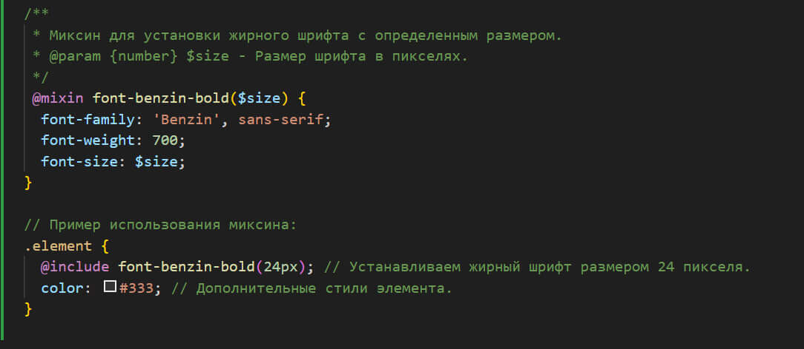
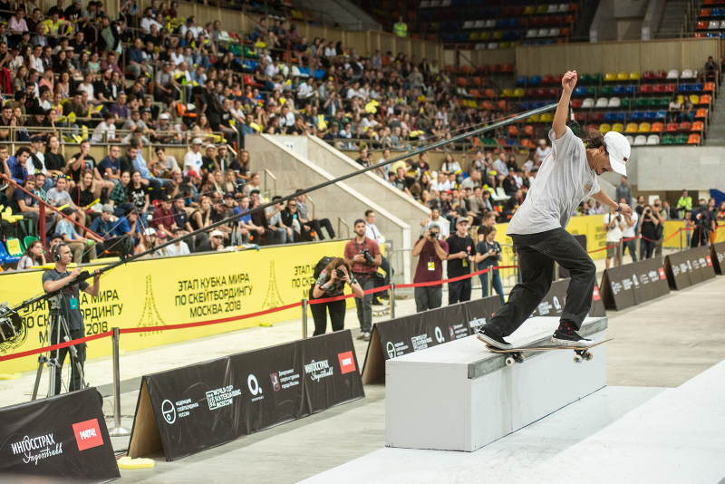

Этот проект представляет собой SPA (Single Page Application) для сайта Общественной Организации "Улицы России". Приложение разработано с использованием TypeScript, React и Vite.js.

### О команде

---

- Ольга Аверьянова ([GitHub](https://github.com/OlgaOlgar47)) - [Telegram](https://t.me/Olga_Averianova47) 📱💻
- Елизавета Журавлева ([GitHub](https://github.com/orgs/StreetRussia-team-4/people/Zhuuravel)) - [Telegram](https://t.me/zhuuravel) 📱💻

### Ссылка на проект

---

Мы настроили автоматическое развертывание нашего проекта на GitHub Pages при каждом пуше в ветку main. 💪🏻 В процессе используется CI для проверки кода и его сборки, после чего он загружается и публикуется на GitHub Pages. Теперь наш сайт всегда актуален и обновляется автоматически! 🚀

Посмотреть проект можно по этой ссылке 👉 [клик](https://streetrussia-team-4.github.io/frontend/)

### Стек технологий

---

  
  
  
  
  
  

### Инструменты разработчика

---

  
  
  
  
  
  
  
  
  
  
  

### Сторонние библиотеки

---

Для разработки нашего проекта мы использовали несколько сторонних библиотек, которые значительно упростили нам жизнь:

- **React Player**: для встраивания и управления видео и аудио контентом. Очень удобно для воспроизведения медиафайлов прямо в приложении.

  

- **React Slick**: для красивых и адаптивных слайдеров/каруселей. Идеально подходит для показа изображений, и других контентных элементов.

  

- **React DayPicker**: для работы с выбором дат. Позволяет легко добавлять календарные элементы в ваш проект.

  

- **Axios**: для выполнения HTTP-запросов. Проста в использовании и позволяет легко общаться с сервером,
   отправлять и получать данные.
  

### Шрифты

---

В нашем проекте мы использовали стильный и современный шрифт **Benzin**. Этот шрифт помогает придать приложению уникальный и профессиональный вид. Можно найти [здесь](https://bestfonts.pro/font/benzin).👌

### Стиль и Шарм с Sass и Миксинами

---

Мы используем Sass вместе с уникальными миксинами, такими как `font-benzin-bold`, `font-benzin-medium` и `font-benzin-regular`. Kод становится чище, эффективнее и приобретает личность. Мы постоянно работаем над расширением нашей коллекции миксинов!🪄

Пример миксина

### Кодстайл и Принципы работы команды🙏

Как мы пишем код🗃️🐫🛢

  
`Модульная Структура`: У нас как в детской конструкторе LEGO - каждый компонент в своей уютной коробочке. Это помогает нам не запутаться и с легкостью добавлять и удалять части без паники.

`"Barrel Pattern"`: Не, это не название нового коктейля! Это наша секретная формула для простого импорта. Ставьте на полку файл index.ts, и все компоненты будут в ваших руках!

`SCSS и CamelCase`: Наши стили - настоящие модники. Мы используем SCSS для того, чтобы стили были такими гладкими, как шелк, а названия классов придумываем в стиле "король верблюда" - CamelCase!

`Именной Импорт`: У нас как на эксклюзивной вечеринке - без приглашения не впустят! Именно поэтому мы используем только именные импорты для наших компонентов.

`Префиксы в Коммитах`: Все наши коммиты - это как загадка для стиля. feat, fix, style - каждый префикс как часть нашего секретного языка.

Как мы работаем в команде🤝🏻📢🔗

  
В команде каждый - настоящий артист!
  
`Отдельная Ветка для Каждого`: У нас своя карусель - разработка ведется в своей уютной ветке. Так что никаких сбоев в музыке!

`Слияние в Dev`: Все дороги ведут в Рим, а наши ветки - в dev. Здесь все наши творения сливаются в одно, как магия!

`Main - Наша Премьера`: И, конечно, наша последняя версия кода и деплой живут в ветке Main, как настоящие звезды на красной дорожке!

### Установка

---

- `git clone git@github.com:StreetRussia-team-4/frontend.git` - клонируйте репозиторий;

- `cd frontend` - перейдите в директорию проекта;

- `npm install` - yстановите зависимости;

- `npm run dev` - проект запустится на порте `http://localhost:5173`;🔥

### Архив с кодом репозитория из main

---

[Ссылка на архив с кодом репозитория из main](https://disk.yandex.com/d/piisShH2oeiotQ)

### Архив со скриншотами

---

[Ссылка на архив со скриншотами](https://disk.yandex.com/d/4WJ7-AvosFhitQ)

### Вид приложения

---

 Скриншот интерфейса приложения

